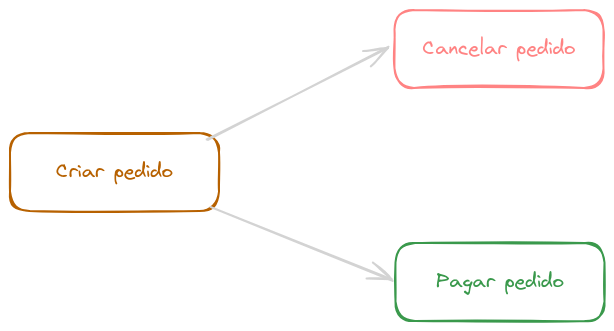

# Definição de API Rest

## Checklist para considerar uma API como Rest
- **Cliente/servidor:** Separação entre as responsailidades de tela e processamento/armazenamento de dados.
- **Stateless:** Cada requisição do cliente para o servidor deve conter todas as informações necessárias para o servidor entender e processar a solicitação. Ou seja, cada requisição é independente.
- **Cache:** As respostas de uma API REST devem ser explicitamente rotuladas como cacheáveis ou não-cacheáveis. Quando uma resposta é cacheável, o cliente pode reutilizar os dados em requisições subsequentes, o que melhora a eficiência da rede, reduz a latência e diminui a carga nos servidores.
- **Interface uniforme**:
  - **Identificação de recursos nas requisições**: Cada recurso é identificado por um identificador único, geralmente um URI (Uniform Resource Identifier). Isso permite que o cliente referencie e acesse diretamente os recursos no servidor.
  - **Manipulação de recursos por meio de representações:** Os recursos são manipulados por meio de suas representações, como JSON ou XML. O cliente interage com o servidor enviando representações de recursos que deseja criar, modificar ou excluir, e o servidor responde com representações dos recursos solicitados.
  - **Mensagens auto descritivas:** Cada mensagem trocada entre cliente e servidor deve conter informações suficientes para descrever como processar a mensagem. Isso inclui informações sobre como interpretar a mensagem (tipos de mídia, esquemas de dados) e metadados relevantes (status de resposta, cabeçalhos HTTP). Mensagens auto-descritivas ajudam a tornar a comunicação mais clara e reduz a necessidade de documentação externa.
  - **HATEOAS (Hypermedia as the Engine of Application State):** Este princípio garante que a interação com a API seja guiada por hypermedia, como links. Cada resposta do servidor deve incluir links para outras ações possíveis a partir da que foi executada, permitindo que o cliente navegue pela API dinamicamente. Isso proporciona uma maior flexibilidade e escalabilidade, pois o cliente não precisa conhecer a estrutura da API antecipadamente.

    ```json
    {
      "order_id": "123456",
      "status": "pending",
      "total_amount": 150.99,
      "links": [
        {
          "rel": "self",
          "href": "https://api.pizzashop.com/orders/123456"
        },
        {
          "rel": "cancel",
          "href": "https://api.pizzashop.com/orders/123456/cancel"
        },
        {
          "rel": "payment",
          "href": "https://api.pizzashop.com/orders/123456/payment"
        }
      ]
    }
    ```
    
    - No exemplo acima, na lista de links, é possível ver o objeto self, que representa a URL atualmente em uso. Além disso, estão listadas outras URLs possíveis que podem ser acessadas a partir da URL atual.

- **Sistema em camadas:** A arquitetura de um sistema REST pode ser composta por várias camadas, sem que os clientes (interfaces de usuário) precisem saber sobre a existência dessas camadas intermediárias.

## Modelo de maturidade de Richardson
- **Nível 0 (The Swamp of POX):** Neste nível, a API usa um único verbo HTTP que aceita qualquer tipo de solicitação. Por exemplo, o usar o verbo HTTP POST para todas as operações da API.
- **Nível 1 (Recursos):** A API começa a ser dividida em recursos distintos, cada um representado por uma URL única. No entanto, ainda pode não utilizar todos os verbos HTTP corretamente. Por exemplo, a API pode usar apenas GET e POST, mas pelo menos há uma diferenciação clara entre diferentes tipos de dados e funcionalidades através de endpoints específicos.
- **Nível 2 (Verbos HTTP):*** Neste nível, a API usa adequadamente os verbos HTTP (GET, POST, PUT, DELETE, etc.) para realizar operações sobre os recursos. Além disso, os códigos de status HTTP são usados para indicar o resultado das operações (200 OK, 404 Not Found, 201 Created, etc.).
- **Nível 3 (HATEOAS):** Como mencionado anteriormente, as respostas da API incluem links para outros recursos e ações possíveis, permitindo que os clientes naveguem pela API dinamicamente.

## Saiba mais
- [REST APIs must be hypertext-driven](https://roy.gbiv.com/untangled/2008/rest-apis-must-be-hypertext-driven)
- [Stop Calling Your API a "REST API"](https://youtu.be/0vC4Xt4wqTk?si=ACWjA8Fh9YQtO5D0)
